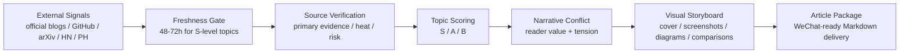

# gzhxz-skills

[English](./README.md) | [中文](./README.zh.md)

AI/tech first-source signal radar and **gzhxz WeChat visual narrative workflow** for Claude Code, Claude Skills, and other file-capable AI agents.

> The goal is not to collect news. The goal is to turn scattered AI/tech signals into **verified, visual-first article packages that an editor can use immediately**.

## What this repository is

This repository packages one production-oriented skill:

| Skill | Purpose | Status |
|---|---|---|
| `gzhxz-visual-story` | AI/tech WeChat article workflow: topic discovery, source verification, visual storyboard, Chinese draft, review, and delivery | Active |

It is designed for AI/tech self-media work:

- Track external first-hand sources.
- Screen and score topic candidates.
- Separate facts, heat, inference, and risk.
- Plan evidence screenshots, mechanism diagrams, comparisons, and article visuals.
- Deliver a structured Markdown article package for WeChat public-account publishing.

## Installation

### Quick Install

```bash
npx skills add lokih1028/lokih1028
```

Then trigger the skill with:

```text
/gzhxz-visual-story
```

or:

```text
Use the gzhxz visual narrative workflow for this AI/tech topic: <url-or-topic>
```

### Register as Claude Code Plugin Marketplace

Run in Claude Code:

```text
/plugin marketplace add lokih1028/lokih1028
```

Then install the plugin:

```text
/plugin install gzhxz-skills@gzhxz-skills
```

### Local Install

```bash
git clone https://github.com/lokih1028/lokih1028.git
cd lokih1028
bash install.sh
```

### Claude.ai ZIP Package

```bash
git clone https://github.com/lokih1028/lokih1028.git
cd lokih1028
bash install.sh --package-only
```

Upload the generated file:

```text
packages/gzhxz-visual-story.zip
```

Full guide: [docs/install.md](./docs/install.md)

## Available Plugin

This marketplace exposes a single plugin so the skill is registered once.

| Plugin | Description | Includes |
|---|---|---|
| `gzhxz-skills` | Verified visual-first AI/tech article workflow | `gzhxz-visual-story` |

Marketplace config:

```text
.claude-plugin/marketplace.json
```

## Repository Structure

```text
.
├── .claude-plugin/
│   └── marketplace.json
├── skills/
│   └── gzhxz-visual-story/
│       └── SKILL.md
├── .claude/
│   └── skills/
│       ├── README.md
│       └── gzhxz-visual-story/
│           └── SKILL.md
├── docs/
│   ├── install.md
│   └── gzhxz-workflow.md
├── packages/
│   └── README.md
├── templates/
│   └── article-package.md
├── CLAUDE.md
├── install.sh
├── package.json
└── README.zh.md
```

## Canonical Paths

| Path | Purpose |
|---|---|
| `skills/gzhxz-visual-story/SKILL.md` | Canonical marketplace skill path |
| `.claude/skills/gzhxz-visual-story/SKILL.md` | Legacy/direct-copy compatibility path |
| `.claude-plugin/marketplace.json` | Claude Code plugin marketplace registry |
| `docs/install.md` | Installation and packaging guide |
| `docs/gzhxz-workflow.md` | Human-readable workflow explanation |
| `templates/article-package.md` | Reusable article package template |

## Workflow



In plain language:

**Decide whether it is worth writing → verify what is true → decide how to show it visually → then write.**

## Core Rules

1. **External first-hand sources first**  
   Official announcements, docs, changelogs, GitHub repos/releases/issues, arXiv papers, Product Hunt, Hacker News, and maintainer/researcher posts are preferred.

2. **Chinese secondary media is not primary evidence**  
   It can support heat and distribution context, but not core facts.

3. **Freshness matters**  
   S-level topics normally need a first-hand update within the last 48–72 hours.

4. **Visuals must carry information**  
   Screenshots, diagrams, timelines, and comparisons should prove facts, explain mechanisms, or create narrative turns.

5. **Writing is judgment, not forwarding**  
   The output must separate fact, inference, uncertainty, risk, and opinion.

## Example Prompts

```text
/gzhxz-visual-story https://github.com/example/project
```

```text
Use gzhxz visual narrative workflow V6.8.0 to turn this GitHub repo into a WeChat article package: <repo-url>
```

```text
Run today's AI/tech topic scan. Give me 3-5 candidates, score them, then recommend the strongest one.
```

```text
Check whether this topic is worth writing: freshness, source quality, heat, risk, and visual opportunities.
```

## Standard Output

A full delivery usually contains:

- Candidate topic cards
- Primary source pack
- User voice / community feedback
- Narrative conflict
- Visual storyboard
- Title pool
- Chinese article draft
- Image insertion plan
- Risk notes
- Editor-ready Markdown package

## Who this is for

- AI/tech self-media editors
- People who need fast topic judgment
- Writers turning AI launches into evidence-backed articles
- Claude Skill authors looking for a concrete workflow example
- Anyone interested in first-source monitoring, topic scoring, and visual storytelling

## License

MIT
