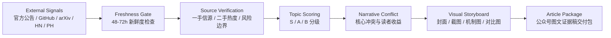

# lokih1028 · AI/Tech Signal Radar

> 一手信源不是终点，**能被编辑直接拿去写的选题判断**才是终点。

这个仓库是我的公开工作台：把 AI / 科技领域的一手信源监控、选题筛选、事实核验、视觉叙事和公众号图文交付流程整理成可复用的 workflow。

它不是单纯存 Claude Skills 的地方。

它更像一个 **AI/科技自媒体前置雷达 + gzhxz 公众号视觉叙述流水线**。

---

## Download & Install

核心 Skill 在这里：

```text
.claude/skills/gzhxz-visual-story/SKILL.md
```

如果你在 GitHub 下载 ZIP 后没看到 `.claude`，通常不是文件丢了，而是因为 `.claude` 是隐藏目录。终端里用 `ls -la` 查看。

### Claude Code 一键安装

```bash
git clone https://github.com/lokih1028/lokih1028.git
cd lokih1028
bash install.sh
```

安装后可直接在 Claude Code 里调用：

```text
/gzhxz-visual-story
```

或自然语言触发：

```text
使用 gzhxz 公众号视觉叙述创作工作流 V6.8.0
```

### 手动安装

```bash
git clone https://github.com/lokih1028/lokih1028.git
cd lokih1028
mkdir -p ~/.claude/skills
cp -R .claude/skills/gzhxz-visual-story ~/.claude/skills/
```

### Claude.ai 上传 ZIP

```bash
mkdir -p packages
cd .claude/skills
zip -r ../../packages/gzhxz-visual-story.zip gzhxz-visual-story
```

然后在 Claude.ai：

```text
Customize > Skills > Upload
```

上传 `packages/gzhxz-visual-story.zip`。

完整说明见：`docs/install.md`

---

## 这个库解决什么问题？

AI 资讯太多，真正难的不是“看到新闻”，而是：

- 哪些消息值得今天写？
- 哪些只是二手转述，不能当事实源？
- 这个产品/论文/项目到底新在哪？
- 能不能做成一篇有图、有证据、有冲突的公众号文章？
- 编辑拿到之后，能不能马上开写？

所以这个库的目标很简单：

**把分散的 AI/科技信号，变成经过核验、分级、可视化设计后的选题弹药。**

---

## 工作流一眼版



说白了：

**先判断值不值得写，再判断怎么写，最后才开始写。**

---

## 仓库里有什么？

```text
.
├── README.md
├── install.sh
├── .claude/
│   └── skills/
│       ├── README.md
│       └── gzhxz-visual-story/
│           └── SKILL.md
├── docs/
│   ├── install.md
│   └── gzhxz-workflow.md
├── packages/
│   └── README.md
└── templates/
    └── article-package.md
```

### 核心文件

| 路径 | 用途 |
|---|---|
| `.claude/skills/gzhxz-visual-story/SKILL.md` | Claude Skill 主文件：gzhxz 公众号视觉叙述工作流 V6.8.0 |
| `install.sh` | Claude Code 本地一键安装脚本；本机有 `zip` 时会顺手生成 ZIP 包 |
| `docs/install.md` | 下载、安装、打包、上传 Claude.ai 的完整说明 |
| `packages/README.md` | 本地打包 ZIP 的说明 |
| `.claude/skills/README.md` | Skill 索引、触发方式和适用场景 |
| `docs/gzhxz-workflow.md` | 面向人看的工作流说明：从选题到交付的阶段拆解 |
| `templates/article-package.md` | 公众号图文证据稿交付模板，可复制复用 |

---

## 核心工作流：gzhxz Visual Story

这个 Skill 用来把一个 AI/科技主题、链接、GitHub 项目、论文、产品发布或社区信号，变成一套 **可核验、可视化、可编辑接手** 的公众号文章包。

它默认遵守几个硬规则：

1. **选题优先来自外部一手或近一手信源**  
   例如官方 Blog、文档、Changelog、GitHub、arXiv、Product Hunt、Hacker News、研究者/创始人公开发布等。

2. **中文二手媒体不能当原始事实源**  
   可以用来辅助判断传播热度，但不能拿来证明核心事实。

3. **S 级选题必须足够新**  
   通常需要 48–72 小时内的一手更新；老话题除非有新进展，否则不能硬装新鲜。

4. **每张图都要有信息价值**  
   截图、机制图、对比图、时间线、架构图，都必须服务于事实证明或叙事转折。

5. **写作不是搬运，是判断**  
   输出要区分事实、推测、风险和观点。

---

## 适合怎么用？

### 1. 从一个链接开始

```text
使用 gzhxz 公众号视觉叙述创作工作流 V6.8.0，围绕这个 GitHub 项目做一篇图文证据稿：<repo-url>
```

### 2. 从一个热点开始

```text
把这个 AI 产品发布做成公众号文章，要有信源截图、核心冲突和配图规划：<announcement-url>
```

### 3. 从空白选题开始

```text
今天跑一下公众号选题 SOP，先给 3-5 个 AI/科技候选选题，再推荐最值得写的一个。
```

### 4. 只做编辑前置筛选

```text
帮我判断这个选题值不值得写：新鲜度、信源、热度、风险、可视化机会分别打分。
```

---

## 标准输出长什么样？

一次完整交付通常包含：

- 候选选题卡
- 一手信源包
- 用户声音 / 社区反馈
- 核心冲突
- 视觉 storyboard
- 文章标题池
- 正文初稿
- 图片插入建议
- 风险提醒
- 编辑可直接使用的 Markdown 包

更完整的模板见：`templates/article-package.md`

---

## 我的关注方向

- AI Agents / MCP / Open-source AI tooling
- LLM 产品更新与开发者生态
- GitHub 高动量项目
- arXiv / 研究机构新工作
- Product Hunt / Hacker News / 开发者社区信号
- AI 工具从 demo 到真实可用之间的那段灰区

一句话：

**少搬运，多核验；少堆料，多判断。**

---

## 适合谁看？

- AI/科技自媒体编辑
- 需要快速判断选题价值的人
- 想把 AI 热点做成图文证据稿的人
- 需要 Claude Skill 工作流示例的人
- 对一手信源监控、选题分级、视觉叙事感兴趣的人

---

## Status

这个仓库会持续迭代：

- 更清晰的选题评分卡
- 更多 article package 模板
- GitHub AI 项目发现 SOP
- 每日 AI/科技简报模板
- 面向编辑协作的交付格式

如果你只想看核心工作流，从这里开始：

👉 `.claude/skills/gzhxz-visual-story/SKILL.md`
