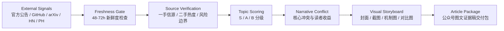

# gzhxz-skills

[English](./README.md) | 中文

面向 Claude Code、Claude Skills 和其他可读写文件 Agent 的 **AI/科技一手信源雷达 + gzhxz 公众号视觉叙述工作流**。

> 一手信源不是终点，**能被编辑直接拿去写的选题判断**才是终点。

## 这个仓库是什么

这个仓库目前打包一个真实工作流 Skill：

| Skill | 用途 | 状态 |
|---|---|---|
| `gzhxz-visual-story` | AI/科技公众号视觉叙述创作工作流：选题、信源、配图、初稿、审核、交付 | Active |

它不是单纯存 Claude Skills 的地方。

它更像一个 **AI/科技自媒体前置雷达 + 公众号图文证据稿流水线**。

目标是把分散的 AI/科技信号，变成经过核验、分级、可视化设计后的选题弹药。

## 安装

### 快速安装

```bash
npx skills add lokih1028/lokih1028
```

安装后触发：

```text
/gzhxz-visual-story
```

或自然语言触发：

```text
使用 gzhxz 公众号视觉叙述创作工作流 V6.8.0
```

### 注册为 Claude Code Plugin Marketplace

在 Claude Code 中运行：

```text
/plugin marketplace add lokih1028/lokih1028
```

然后安装插件：

```text
/plugin install gzhxz-skills@gzhxz-skills
```

### Clone 后本地安装

```bash
git clone https://github.com/lokih1028/lokih1028.git
cd lokih1028
bash install.sh
```

### 生成 Claude.ai ZIP 包

```bash
git clone https://github.com/lokih1028/lokih1028.git
cd lokih1028
bash install.sh --package-only
```

然后上传本地生成的：

```text
packages/gzhxz-visual-story.zip
```

完整说明见：[docs/install.md](./docs/install.md)

## 可用插件

这个 marketplace 只暴露一个插件，避免重复注册同一个 Skill。

| Plugin | 说明 | 包含 |
|---|---|---|
| `gzhxz-skills` | 可核验、视觉优先的 AI/科技公众号文章工作流 | `gzhxz-visual-story` |

Marketplace 配置文件：

```text
.claude-plugin/marketplace.json
```

## 仓库结构

```text
.
├── .claude-plugin/
│   └── marketplace.json
├── skills/
│   └── gzhxz-visual-story/
│       └── SKILL.md
├── .claude/
│   └── skills/
│       ├── README.md
│       └── gzhxz-visual-story/
│           └── SKILL.md
├── docs/
│   ├── install.md
│   └── gzhxz-workflow.md
├── packages/
│   └── README.md
├── templates/
│   └── article-package.md
├── CLAUDE.md
├── install.sh
├── package.json
└── README.md
```

## 关键路径

| 路径 | 用途 |
|---|---|
| `skills/gzhxz-visual-story/SKILL.md` | marketplace 规范 Skill 路径 |
| `.claude/skills/gzhxz-visual-story/SKILL.md` | 兼容旧版手动复制路径 |
| `.claude-plugin/marketplace.json` | Claude Code plugin marketplace 注册文件 |
| `docs/install.md` | 安装、打包、上传说明 |
| `docs/gzhxz-workflow.md` | 面向人看的工作流说明 |
| `templates/article-package.md` | 公众号图文证据稿交付模板 |

## 工作流一眼版



说白了：

**先判断值不值得写，再判断怎么写，最后才开始写。**

## 核心原则

1. **选题优先来自外部一手或近一手信源**  
   例如官方 Blog、文档、Changelog、GitHub、arXiv、Product Hunt、Hacker News、研究者/创始人公开发布等。

2. **中文二手媒体不能当原始事实源**  
   可以用来辅助判断传播热度，但不能拿来证明核心事实。

3. **S 级选题必须足够新**  
   通常需要 48–72 小时内的一手更新；老话题除非有新进展，否则不能硬装新鲜。

4. **每张图都要有信息价值**  
   截图、机制图、对比图、时间线、架构图，都必须服务于事实证明或叙事转折。

5. **写作不是搬运，是判断**  
   输出要区分事实、推测、风险和观点。

## 适合怎么用

```text
/gzhxz-visual-story https://github.com/example/project
```

```text
使用 gzhxz 公众号视觉叙述创作工作流 V6.8.0，围绕这个 GitHub 项目做一篇图文证据稿：<repo-url>
```

```text
今天跑一下公众号选题 SOP，先给 3-5 个 AI/科技候选选题，再推荐最值得写的一个。
```

```text
帮我判断这个选题值不值得写：新鲜度、信源、热度、风险、可视化机会分别打分。
```

## 标准输出

一次完整交付通常包含：

- 候选选题卡
- 一手信源包
- 用户声音 / 社区反馈
- 核心冲突
- 视觉 storyboard
- 文章标题池
- 正文初稿
- 图片插入建议
- 风险提醒
- 编辑可直接使用的 Markdown 包

## 适合谁看

- AI/科技自媒体编辑
- 需要快速判断选题价值的人
- 想把 AI 热点做成图文证据稿的人
- 需要 Claude Skill 工作流示例的人
- 对一手信源监控、选题分级、视觉叙事感兴趣的人

## License

MIT
